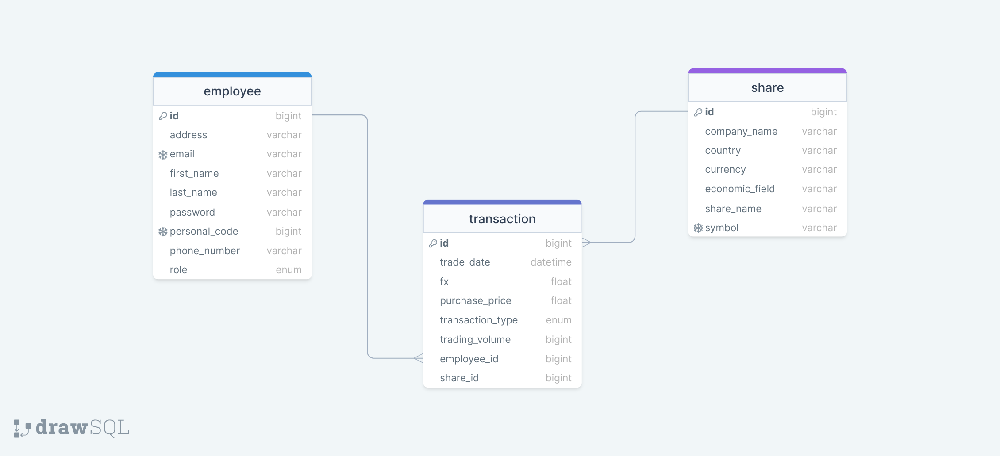

# STOCK MANAGEMENT WEB APPLICATION

## Overview
This web application is designed for a company that manages employees buying stocks. It provides a user-friendly interface for signing up as an ADMIN or USER, managing employees, shares, and transactions, and includes an API integration for accessing current market prices.

## General Guidelines
The application is built using the following technologies and practices:
- Spring Boot
- Spring Security
- Entity / DTO (Data transfer object)
- Lombok
- Spring Test
- JPA (Hibernate)
- Spring Security for access control
- REST API
- HTML, CSS, TypeScript, Bootstrap

## Functionalities

### Bootstrap Integration
- Bootstrap is integrated into each page, ensuring a responsive and visually appealing user interface.

### User Login
- Users are required to log in using their email and password.
- Spring Security is used for user authentication.
- After successful login, users are redirected to the home page.
- A logout button is available on the top-right corner of each page for easy log-out.

### Home Page
- The initial page is the Portfolio, which displays real-time trade marketing prices retrieved from an API.
- The Portfolio is linked with the shares added to the system.

### Employee Management
- Features for adding, editing, deleting, and searching employees are provided.
- Only ADMIN users can add new employees.
- The list of employees is updated in real-time when an employee is added, edited, or deleted.
- A user-friendly form is available for adding and editing employee information.

### Share Management
- The Shares page lists all shares added to the system.
- Users can add, edit, and search for shares.
- A form is available for adding and editing share information.

### Transaction Management
- The Transaction page is linked to both employees and shares.
- Each employee can add a new transaction, edit existing transactions, and remove transactions if the balance allows.
- A search engine is provided for easy transaction retrieval.
- Users can see which employee a transaction is related to.
- A user-friendly form is available for adding and editing transactions.

### Access Control
- Only logged-in users can access and view information related to employees, shares, and transactions.

### Testing
- Backend tests have been implemented for Login user, Repository, and Services to ensure the reliability of the application.

### API Integration
- The application integrates with an external API, allowing users to request current market prices.
- Users are allowed up to 8 requests per minute and 800 requests per day.
- API WEBSITE: https://twelvedata.com

